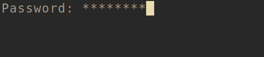

+++ 
draft = false
date = 2022-10-31T00:00:00+02:00
title = "ECW 2022 - UEFI"
description = "The ECW 2022 UEFI official write-up"
slug = ""
authors = []
tags = [
    "CTF",
    "ECW",
    "UEFI"
]
categories = [
    "CTF"
]
externalLink = ""
series = [ "ECW" ]
+++

**UEFI** is a reverse-engineering challenge I designed for the 2022 edition of the [European Cyber Week](https://www.european-cyber-week.eu/).
Here is the [source code for this challenge](https://github.com/valkheim/ECW-2022-UEFI-VM/tree/compression/MyPkg).

You're given a `disk.img` file and the following qemu command line:

```sh
qemu-system-x86_64 -cpu qemu64 \
  -drive if=pflash,format=raw,unit=0,file=OVMF_CODE.fd,readonly=on \
  -drive if=pflash,format=raw,unit=1,file=OVMF_VARS.fd \
  -drive format=raw,file=disk.img,if=virtio \
  -net none \
  -nographic \
  -serial mon:stdio \
  -monitor telnet::45454,server,nowait \
```

This launches an EFI app asking for a password:



Now let’s find out what’s inside the `disk.img` file:

```console
$ md5sum disk.img 
1b7217d4df99afc1c19535c188af9e64  disk.img
$ binwalk --dd=".*" disk.img

DECIMAL       HEXADECIMAL     DESCRIPTION
--------------------------------------------------------------------------------
1788416       0x1B4A00        Microsoft executable, portable (PE)
1792965       0x1B5BC5        Unix path: /home/valkheim/workspace/ecw_uefi/edk2/MdePkg/Library/BasePrintLib/PrintLibInternal.c
1793612       0x1B5E4C        Unix path: /home/valkheim/workspace/ecw_uefi/edk2/MdePkg/Library/UefiBootServicesTableLib/UefiBootServicesTableLib.c
```

This output should give you somes hints about what's inside the `disk.img file`.
When reverse engineering the PE at 0x1B4A00, we find that it's a dropper for another efi app.
A first stage efi app is extracting and loading a second stage app.

To retrieve the second stage, you have two options:

* **dynamically** by breaking after the decompression process. From there dump the memory region associated with the second EFI application
* **statically** by extracting the compressed/encoded buffer from the first app and decompress manually

Here, I only show the decompression / decoding process for the static way:

First, locate the second stage (help yourself from xrefs):


Then, extract compressed/encoded second stage app:

```console
$ dd if=_disk.img.extracted/1B4A00 of=compressed_efi_app.bin bs=1 count=936 skip=6336 
$ md5sum compressed_efi_app.bin 
287161b4938cff80961af8ab97b26831  compressed_efi_app.bin
```

Finally, decompress:

```python
$ python3.8
Python 3.8.10 (default, Jun 22 2022, 20:18:18) 
[GCC 9.4.0] on linux
Type "help", "copyright", "credits" or "license" for more information.
>>> import EfiCompressor
>>> with open("compressed_efi_app.bin", "rb") as fh:
...     data = bytearray(fh.read())
...     data_len = len(data)
... 
>>> EfiCompressor.UefiDecompress.__doc__
'Decompress(): Decompress data using UEFI standard algorithm\n'
>>> decompressed = EfiCompressor.UefiDecompress(data, data_len)
>>> with open("decompressed.bin", "wb") as fh:
...     fh.write(decompressed)
... 
2048
>>> quit()
```

I used the python-eficompressor package which is a python wrapper for the standard decompression algorithm.


The standard UEFI decompression is the lzma one, not the tiano custom one. There exists a reference implementation shipped with the UEFI specification.


Decode:

```python
$ python3.8
Python 3.8.10 (default, Jun 22 2022, 20:18:18)
[GCC 9.4.0] on linux
Type "help", "copyright", "credits" or "license" for more information.
>>> with open("decompressed.bin", "rb") as fh:
...     data = bytearray(fh.read())
...
>>> for i in range(len(data)):
...     data[i] = data[i] ^ 0x71
...
>>> with open("stage2.efi", "wb") as fh:
...     fh.write(data)
...
2048
>>> quit()
```

When decompressed, we should have another EFI application:

```console
$ file stage2.efi
stage2.efi: PE32+ executable (DLL) (EFI application) EFI byte code, for MS Windows
```

The second stage is an EFI byte code stage, yay! EFI byte code virtual machine is well defined in the specification. Hence, you should be able to decode the risc and understand the password-asking procedures.

You can also pick a tool to do this for you (e.g. https://github.com/Pebaz/spore). Here is a `spore` dump I annotated for convenience:

```console
$ spore stage2.efi
Print:
        79 01 C0 12  MOVRELw R1, 4800
              20 91  MOVq R1, @R1
        72 91 85 21  MOVnw R1, @R1(+5, +24)
        B5 08 10 00  PUSHn @R0(+0, +16)
              35 01  PUSHn R1
  83 29 01 00 00 10  CALL32EXa @R1(+1, +0)
        60 00 02 10  MOVqw R0, R0(+2, +0)
                 04  RET

 Gtfo:
        79 01 A4 12  MOVRELw R1, 4772
              32 96  MOVn R6, @R1
        72 E6 88 21  MOVnw R6, @R6(+8, +24)
        77 31 02 00  MOVIqw R1, 2
        77 32 00 00  MOVIqw R2, 0
        77 33 00 00  MOVIqw R3, 0
              35 03  PUSHn R3
              35 03  PUSHn R3
              35 02  PUSHn R2
              35 01  PUSHn R1
  83 2E 8A 01 00 10  CALL32EXa @R6(+10, +24)
        60 00 04 20  MOVqw R0, R0(+4, +0)
                 04  RET

EfiMain:
        79 01 7A 12  MOVRELw R1, 4730
        72 89 41 10  MOVnw @R1, @R0(+1, +16)

              20 91  MOVq R1, @R1
        72 91 85 21  MOVnw R1, @R1(+5, +24)
        79 02 A6 12  MOVRELw R2, 4774
              6B 02  PUSH64 R2
              35 01  PUSHn R1
  83 29 01 00 00 10  CALL32EXa @R1(+1, +0)
        60 00 02 10  MOVqw R0, R0(+2, +0)

              56 22  XOR64 R2, R2               ; init password counter
              6B 02  PUSH64 R2                  ; save counter

ST->ConIn->Reset()
        79 01 56 12  MOVRELw R1, 4694
              20 91  MOVq R1, @R1
        72 91 63 10  MOVnw R1, @R1(+3, +24)
        77 32 00 00  MOVIqw R2, 0
              35 02  PUSHn R2
              35 01  PUSHn R1
              03 29  CALL32EXa @R1
              36 01  POPn R1
              36 02  POPn R2

BS->WaitForEvent()
        79 03 3E 12  MOVRELw R3, 4670
              20 B3  MOVq R3, @R3
        72 B3 89 21  MOVnw R3, @R3(+9, +24)
        79 02 3C 12  MOVRELw R2, 4668
              35 02  PUSHn R2
        60 11 02 10  MOVqw R1, R1(+2, +0)
              6B 01  PUSH64 R1
        77 31 01 00  MOVIqw R1, 1
              35 01  PUSHn R1
  83 2B 89 01 00 10  CALL32EXa @R3(+9, +24)
        60 00 03 10  MOVqw R0, R0(+3, +0)

ST->ConIn->ReadKeyStroke()
        79 01 18 12  MOVRELw R1, 4632
              20 91  MOVq R1, @R1
        72 91 63 10  MOVnw R1, @R1(+3, +24)
        79 02 5E 12  MOVRELw R2, 4702
              35 02  PUSHn R2
              35 01  PUSHn R1
  83 29 01 00 00 10  CALL32EXa @R1(+1, +0)
        60 00 02 10  MOVqw R0, R0(+2, +0)

ST->ConIn->Reset()
        79 01 FC 11  MOVRELw R1, 4604
              20 91  MOVq R1, @R1
        72 91 63 10  MOVnw R1, @R1(+3, +24)
        77 32 00 00  MOVIqw R2, 0
              35 02  PUSHn R2
              35 01  PUSHn R1
              03 29  CALL32EXa @R1
        60 00 02 10  MOVqw R0, R0(+2, +0)

ST->ConOut->OutputString(conout, L"*")
        77 11 00 00  MOVIww R1, 0
              6B 01  PUSH64 R1
        77 11 2A 00  MOVIww R1, 42              ; print a '*' for a key read
              6B 01  PUSH64 R1
        77 11 00 00  MOVIww R1, 0
              6B 01  PUSH64 R1
        60 01 01 10  MOVqw R1, R0(+1, +0)
              6B 01  PUSH64 R1
        79 01 CC 11  MOVRELw R1, 4556
              20 91  MOVq R1, @R1
        72 91 85 21  MOVnw R1, @R1(+5, +24)
              35 01  PUSHn R1
  83 29 01 00 00 10  CALL32EXa @R1(+1, +0)
        60 00 05 20  MOVqw R0, R0(+5, +0)

              36 02  POPn R2                    ; get counter

Get unicode char of key
        79 01 04 12  MOVRELw R1, 4612
        72 11 02 00  MOVnw R1, R1 2
              1E 94  MOVw R4, @R1

Get current flag char
        79 05 E6 0E  MOVRELw R5, 3814           ; data/preflag base addr
        77 36 80 00  MOVIqw R6, 128
        77 33 02 00  MOVIqw R3, 2
              4E 36  MUL64 R6, R3
              4E 36  MUL64 R6, R3               ; offset by 2*2*128
              4E 23  MUL64 R3, R2
              4C 35  ADD64 R5, R3
              4C 65  ADD64 R5, R6
              1E D5  MOVw R5, @R5               ; flag[2*i]

Junk (1+3+3=7)
        77 31 01 00  MOVIqw R1, 1
              4C 13  ADD64 R3, R1
              4C 31  ADD64 R1, R3
              4C 31  ADD64 R1, R3
        6D 01 07 00  CMPI64weq R1, 7
              82 00  JMP8cc 0

Cmp flag char value
        77 33 04 00  MOVIqw R3, 4               ; Flag rot
              4C 35  ADD64 R5, R3
              45 54  CMPeq64 R4, R5
              82 8F  JMP8cc -113

Test length
        77 33 01 00  MOVIqw R3, 1
              4C 32  ADD64 R2, R3
        6F 02 18 00  CMPI64wgte R2, 24
              82 8A  JMP8cc -118

Goodboy
        79 01 7C 11  MOVRELw R1, 4476
              6B 01  PUSH64 R1
  83 10 A0 FE FF FF  CALL32 R0 -352
              6C 01  POP64 R1

  83 10 B4 FE FF FF  CALL32 R0 -332             ; goto gtfo

                 04  RET

Then some data (3814)
```


The UEFI specification will help you identify the system table as well as the boot and runtime services tables used here.


At this point we identified and isolated th ebasic blocks responsible for the flag decoding (paying attention to utf-16). What we can do is to rot/grep the efi app. I'll do it on the data section specifically:

```console
$ dd if=stage2.efi of=stage2_data.bin bs=1 count=702 skip=1024
702+0 records in
702+0 records out
702 bytes copied, 0,00406523 s, 173 kB/s
$ xxd stage2_data.bin
00000000: 7800 3000 6300 5600 2400 3200 6500 6b00  x.0.c.V.$.2.e.k.
00000010: 4600 3200 5100 6900 7a00 7600 3600 5e00  F.2.Q.i.z.v.6.^.
00000020: 6f00 7900 7100 5e00 7000 5500 4800 4b00  o.y.q.^.p.U.H.K.
00000030: 5500 6700 4600 6a00 3100 4a00 6400 5f00  U.g.F.j.1.J.d._. ;
00000040: 5f00 5600 3400 4c00 4b00 5700 3400 3500  _.V.4.L.K.W.4.5. ; :eyes:
00000050: 4800 3300 5200 3300 5f00 5f00 5100 7600  H.3.R.3._._.Q.v. ;
00000060: 4e00 3300 4000 7300 4d00 7700 4700 6500  N.3.@.s.M.w.G.e.
00000070: 5700 7700 3000 5600 4b00 4200 5900 4600  W.w.0.V.K.B.Y.F.
00000080: 7a00 5200 6200 7600 6900 7100 3600 7500  z.R.b.v.i.q.6.u.
00000090: 2300 3700 5200 4100 3900 4100 7200 6e00  #.7.R.A.9.A.r.n.
000000a0: 4d00 3800 5800 4400 4900 4500 4500 7600  M.8.X.D.I.E.E.v.
000000b0: 4800 5100 2600 4800 4700 5400 4000 5300  H.Q.&.H.G.T.@.S.
000000c0: 7600 2600 4c00 5500 5a00 6400 6200 3400  v.&.L.U.Z.d.b.4.
000000d0: 4200 4600 3600 2500 3200 5f00 3400 6400  B.F.6.%.2._.4.d.
000000e0: 6300 6900 3300 3300 3500 3900 3500 5e00  c.i.3.3.5.9.5.^.
000000f0: 5600 5a00 5100 6500 6f00 6a00 6900 5e00  V.Z.Q.e.o.j.i.^.
00000100: 7a00 5e00 7500 6300 5000 5600 6800 6300  z.^.u.c.P.V.h.c.
00000110: 2300 2600 6300 5400 3600 2300 4e00 4800  #.&.c.T.6.#.N.H.
00000120: 3000 5e00 3900 3700 4f00 2400 3700 5700  0.^.9.7.O.$.7.W.
00000130: 7100 6f00 6600 4d00 3300 7000 4800 7000  q.o.f.M.3.p.H.p.
00000140: 7900 4d00 7300 5900 3400 5700 6500 5400  y.M.s.Y.4.W.e.T.
00000150: 7400 5300 2600 6500 6500 4e00 7700 7100  t.S.&.e.e.N.w.q.
00000160: 3400 3600 3600 6b00 5600 3600 5f00 5f00  4.6.6.k.V.6._._.
00000170: 4700 4800 4700 3700 6500 2600 5300 2600  G.H.G.7.e.&.S.&.
00000180: 5200 6500 7500 4f00 3300 3500 3300 7000  R.e.u.O.3.5.3.p.
00000190: 7600 5e00 5500 7000 7000 4c00 6400 3500  v.^.U.p.p.L.d.5.
000001a0: 2a00 2400 3500 2100 5400 4400 5f00 5f00  *.$.5.!.T.D._._.
000001b0: 6e00 6900 7000 6700 6400 7500 5a00 6400  n.i.p.g.d.u.Z.d.
000001c0: 7800 7a00 7600 2300 6f00 4400 5700 6400  x.z.v.#.o.D.W.d.
000001d0: 2600 4400 4600 4e00 7a00 5600 5700 4100  &.D.F.N.z.V.W.A.
000001e0: 6d00 4f00 5f00 3700 6a00 4500 4800 3300  m.O._.7.j.E.H.3.
000001f0: 3800 4400 4700 6200 2500 6400 6b00 4100  8.D.G.b.%.d.k.A.
00000200: 4100 3f00 5300 7700 4100 4200 4500 5b00  A.?.S.w.A.B.E.[.
00000210: 3e00 7500 7000 2f00 5b00 5f00 2c00 6000  >.u.p./.[._.,.`.
00000220: 2f00 5b00 6e00 7100 6800 2f00 7600 7900  /.[.n.q.h./.v.y.
00000230: 3400 5000 7200 6800 7300 7500 6c00 5000  4.P.r.h.s.u.l.P.
00000240: 2500 7700 4d00 4e00 7000 6700 2600 3400  %.w.M.N.p.g.&.4.
00000250: 6300 5200 5900 3700 5300 3800 7800 5e00  c.R.Y.7.S.8.x.^.
00000260: 2100 5600 6500 7000 7400 6e00 3900 6b00  !.V.e.p.t.n.9.k.
00000270: 4b00 5f00 5f00 5000 3800 4400 3300 6a00  K._._.P.8.D.3.j.
00000280: 3400 3100 5600 2500 7100 6b00 7400 4200  4.1.V.%.q.k.t.B.
00000290: 3700 6900 5f00 4c00 2600 5600 6900 4a00  7.i._.L.&.V.i.J.
000002a0: 6400 7200 3100 2500 2300 5000 2600 4400  d.r.1.%.#.P.&.D.
000002b0: 6800 7900 3400 4300 3300 4800 0000       h.y.4.C.3.H...
```

Apply the rot:

```python
$ python
Python 3.10.7 (main, Sep  7 2022, 15:22:19) [GCC 9.4.0] on linux
Type "help", "copyright", "credits" or "license" for more information.
>>> with open("stage2_data.bin", "rb") as fh:
...     data = bytearray(fh.read())
...
>>> for i in range(len(data)):
...     if data[i] == 0x00:
...             continue
...     data[i] = data[i] + 4
...
>>> with open("stage2_data_rot.bin", "wb") as fh:
...     fh.write(data)
...
702
```

```console
$ strings -el stage2_data_rot.bin | grep ECW
|4gZ(6ioJ6Um~z:bs}ubtYLOYkJn5NhccZ8PO[89L7V7ccUzR7DwQ{Ki[{4ZOF]J~Vfzmu:y';VE=EvrQ<\HMIIzLU*LKXDWz*PY^hf8FJ:)6c8hgm779=9bZ^Uisnmb~bygTZlg'*gX:'RL4b=;S(;[usjQ7tLt}Qw]8[iXxW*iiR{u8::oZ:ccKLK;i*W*ViyS797tzbYttPh9.(9%XHccrmtkhy^h|~z'sH[h*HJR~Z[EqSc;nIL7<HKf)hoEECW{EFI_Byt3_c0d3_rul3z}8TvlwypT){QRtk*8gV];W<|b%Zitxr=oOccT<H7n85Z)uoxF;mcP*ZmNhv5)'T*Hl}8G7L
```

That last command gave us the flag: `ECW{EFI_Byt3_c0d3_rul3z}`.

I hope you enjoyed it and learned some stuff! Go check the full [source code of this challenge](https://github.com/valkheim/ECW-2022-UEFI-VM/tree/compression/MyPkg).